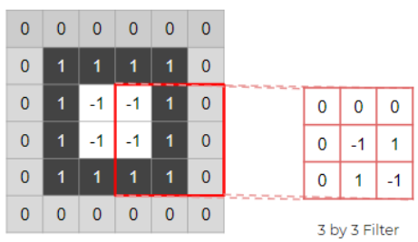
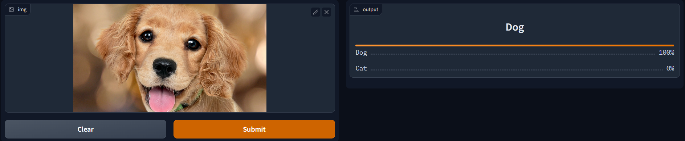

# Proyecto
### Introducción
Deep Learning es una rama de la informática que en la última década ha generado mucha inversión e investigación por parte de compañías privadas en países primer mundistas, es una rama que se ha vuelto muy popular por su capacidad de resolver problemas de clasificación y regresión de manera rápida y eficiente. En este proyecto se pretende mostrar como se puede utilizar Deep Learning para resolver un problema de clasificación de imágenes, en este caso se pretende clasificar imágenes de perros y gatos.

El deep learning es una rama del machine learning basada en las redes neuronales artificiales, que se utilizan para modelar abstracciones de alto nivel en los datos. El deep learning es uno de los mejores campos de las ciencias de la computación en la actualidad porque puede utilizarse para resolver problemas complejos que los métodos tradicionales no pueden. Por ejemplo, el deep learning puede utilizarse para el reconocimiento de imágenes y el procesamiento del lenguaje natural.

En el deep learning intervienen muchas matemáticas, como el álgebra lineal, el cálculo y la probabilidad. Los algoritmos de deep learning también dependen en gran medida de las operaciones matriciales.

Ya que en el semestre hemos visto estadística y probabilidad, y por el hecho de que en los anteriores semestres se ha visto álgebra lineal y cálculo, se puede decir que se tiene la base matemática necesaria para entender el deep learning.

**Objetivos**
- Entender el funcionamiento de las redes neuronales artificiales.
- Utilizar una data real para entrenar una red neuronal.
- Utilizar el lenguaje de programación Python y la librería fastai para entrenar una red neuronal por encima de la API de pytorch.
- Entender como es que las computadoras pueden aprender a clasificar imágenes.

### Como las computadoras aprenden a clasificar imágenes y Software 2.0
**Software 2.0**

Andrej Karpathy, exdirector de Inteligencia Artificial en Tesla escribió un artículo acerca de Software 2.0, explicando en detalle que en un futuro existirá una revolución en donde los desarrolladores dejaran de programar manualmente y se hará la transición a escribir código que escriba código. Esto se relaciona al Deep Learning, ya que el Deep Learning será protagonista de esta revolución, puesto que el Deep Learning es un tipo de software que es capaz de aprender a partir de datos, y que es capaz de hacer que las computadoras puedan cobrar vida propia y tener como la palabra bien lo dice, inteligencia artificial.

**Como las comptuadoras aprenden a clasificar imágenes**

Visión Artificial o Computer Vision es un término general para explicar como es que las computadoras pueden procesar data en imágenes.

La manera en la que una computadora puede entender que es lo que está en una imagen es a través de los píxeles, es decir los números, los píxeles son la unidad más pequeña en una imagen, cada pixel es contiene diferentes valores de color, y estos valores de color son los que la computadora utiliza para clasificar la imagen. Los valores son representados con números.

### Explicación

**PyTorch**

PyTorch es una librería inventada por el laboratorio de Inteligencia Artificial en Meta, anteriormente conocida como Tesla. Dentro del laboratorio trabajan pioneros en el campo del Deep Learning, como Yann Lecun que gano el premio Turing por sus contribuciones en redes neuronales convolucionales.

Pytorch es una librería fácil de utilizar y que permite crear redes neuronales de manera rápida y eficiente, además de que permite utilizar la GPU para entrenar las redes neuronales, lo que permite entrenarlas mucho más rápido.

Muchas compañías de tecnología como Facebook, Uber, Twitter, Pinterest, Snapchat, LinkedIn, Airbnb, Yelp, y muchas otras han adoptado PyTorch para sus proyectos de Deep Learning.

**Fastai**

Fastai es una librería que se utiliza para poder demostrar conceptos de Deep Learning de manera rápida y sencilla, esta librería funciona por encima de Pytorch, lo que quiere decir que muchas de las cosas que se hacen en Pytorch se las puede hacer con fastai de manera mucho más fácil.

**HuggingFace**

HuggingFace es lo que sería equivalente a GitHub, pero exclusivamente para modelos de Deep Learning, en esta plataforma se pueden encontrar modelos de Deep Learning ya entrenados para poder utilizarlos en nuestros proyectos, además de que se pueden subir modelos entrenados por nosotros para que otros puedan utilizarlos, es una plataforma donde podemos crear repositorios con nuestros propios proyectos de Deep Learning, en nuestro proyecto haremos una demostración de como una computadora puede aprender a clasificar imágenes de perros y gatos.

Para poder ver la demostración de nuestro proyecto se lo podrá ver en el siguiente [link](https://huggingface.co/spaces/slf188/Proyecto/tree/main) o escaneando el siguiente código QR.

Dentro del proyecto encontramos la siguiente interfaz:

Aquí nosotros en donde dice "Drop Image Here -or- Click to Upload" podemos descargar y elegir la foto que deseemos de un perro o de un gato, y automáticamente la computadora generara una respuesta de que es lo que ha visto en la imagen proporcionada, aquí un ejemplo:

La interfaz que se ha hecho para mostrar este ejemplo se la escribió en Python y se encuentra en el archivo [app.py](app.py), en donde utilizamos la librería [Gradio](https://gradio.app/).

### Herramientas utilizadas

[Pytorch](https://pytorch.org/)

[Fastai](https://www.fast.ai/)

[HuggingFace](https://huggingface.co/)

[VSCode](https://code.visualstudio.com/)

[Kaggle](https://www.kaggle.com/)

[Git-lfs](https://git-lfs.github.com/)

[Gradio](https://gradio.app/)

### Lenguajes utilizados

[Python](https://www.python.org/)

[Markdown](https://www.markdownguide.org/)

[Shell](https://www.shellscript.sh/)

### Referencias
[PyTorch Vision Resnet](https://pytorch.org/hub/pytorch_vision_resnet/)

[Image-net](https://www.image-net.org/)

[Fastbook](https://github.com/fastai/fastbook)

[Software 2.0](https://karpathy.medium.com/software-2-0-a64152b37c35)

### Licencia
[MIT](LICENSE)

### Autor
Felipe Vallejo
